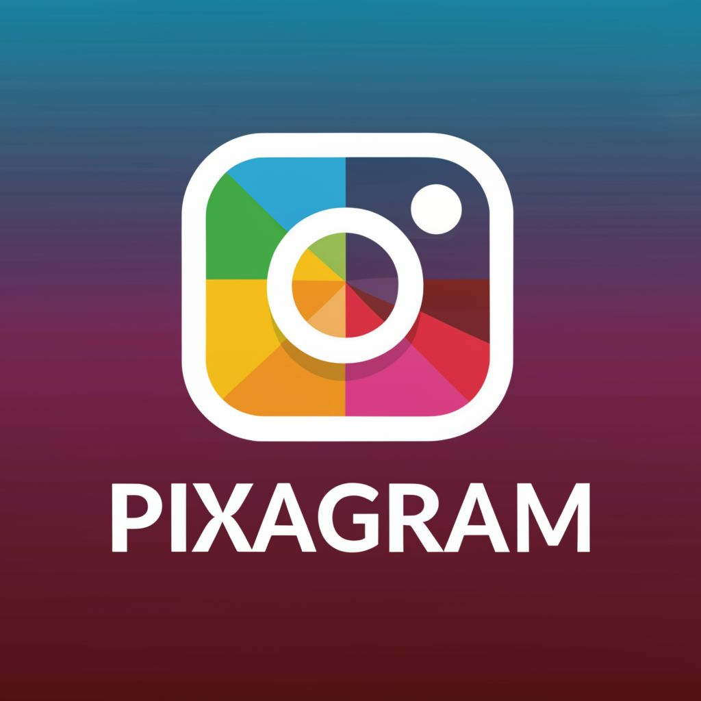

#  Pixagram: A Django-powered Instagram Clone

Pixagram is a social media platform inspired by Instagram, built using the robust Django framework. It empowers users to:

* **Capture and share** captivating photos and videos with their network.
* **Unleash their creativity** with a suite of intuitive editing tools to enhance their content.
* **Explore a diverse and dynamic feed**, brimming with content from other users.
* **Engage and connect** through likes, comments, and follows, fostering a vibrant online community.

**Pixagram boasts:**

* **A user-friendly and aesthetically pleasing interface** for seamless navigation.
* **Effortless photo and video sharing capabilities** to capture and share your moments.
* **A comprehensive set of editing tools** to personalize your visual stories.
* **Engaging social features** to connect and interact with others.

**Embrace Pixagram as your platform to express yourself, connect with the world, and share your captivating visual journey.**
